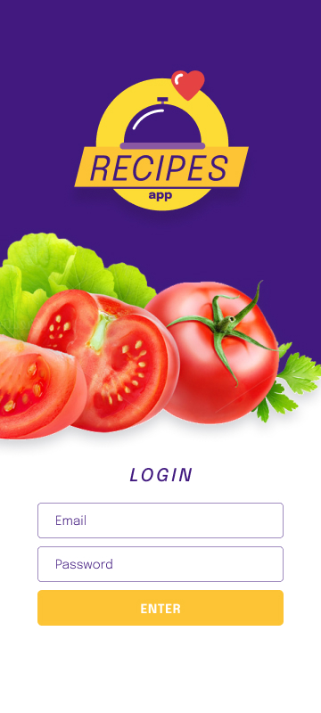

#
[Recipes-App](https://recipes-app-beta-jet.vercel.app/)
#

Uma aplicacao de receitas para o seu dia a dia.

Para testar a aplicação insira um e-mail válido e uma senha com no mínimo 7 digitos.

##
Como instalar?
Faça o clone deste repositório com <code>git clone git@github.com:diogocav/recipe-app-trybe.git</code>

Instale as dependências com <code>npm install</code>

Rode o projeto com <code>npm start</code>
